# DMC CRM — Project Overview & Architecture

> **A B2B Travel Operations CRM for Destination Management Companies (DMCs).**
> This document explains the business domain, the current implementation, the gaps
> between today's code and the product vision, and a recommended roadmap/architecture.
> It is written so a new engineer can understand the whole domain without extra context.

**Repository:** `dmcCRM/` — modular monolith (NestJS backend + React 19 frontend)
**Status of this document:** Reflects the code as of the current branch. Every "current state"
claim below was read directly from source; items marked _Planned_ / _Placeholder_ / _Missing_
have **no implementation** yet.

---

## Table of Contents

1. [Executive Summary](#1-executive-summary)
2. [Business Model Explanation](#2-business-model-explanation)
3. [DMC Industry Workflow](#3-dmc-industry-workflow)
4. [CRM Module Breakdown](#4-crm-module-breakdown)
5. [End-to-End Inquiry Lifecycle](#5-end-to-end-inquiry-lifecycle)
6. [AI Assistant Responsibilities](#6-ai-assistant-responsibilities)
7. [Current State Assessment](#7-current-state-assessment)
8. [Future State Vision](#8-future-state-vision)
9. [Recommended Architecture](#9-recommended-architecture)
10. [Database Entity Suggestions](#10-database-entity-suggestions)
11. [Workflow Diagrams](#11-workflow-diagrams-mermaid)
12. [User Roles & Permissions](#12-user-roles--permissions)
13. [WhatsApp Automation Flow](#13-whatsapp-automation-flow)
14. [Service Catalog Design](#14-service-catalog-design)
15. [Vendor Management Design](#15-vendor-management-design)
16. [Voucher System Design](#16-voucher-system-design)
17. [Accounts Workflow](#17-accounts-workflow)
18. [Product Roadmap](#18-product-roadmap)
19. [Technical Debt / Missing Modules](#19-technical-debt--missing-modules)
20. [Final Project Understanding](#20-final-project-understanding)

---

## 1. Executive Summary

The **DMC CRM** digitizes and automates the operations of a **Destination Management
Company** — a B2B travel operator that sits between a **customer** (usually a travel
agency) and a network of **service providers** (visa processors, hotels, transfer
companies, activity operators, insurers). Today the client runs this business almost
entirely on **WhatsApp + manual work**: manual quotations, manual proposals, manual
follow-ups, manual vendor coordination, manual voucher generation, and manual payment
tracking. The CRM's purpose is to replace that manual chain with a structured pipeline
augmented by an **AI assistant**.

**What exists today (MVP foundation):**

- A working **lead → proposal → fulfillment** pipeline with follow-ups and a per-lead
  activity timeline, all backed by MongoDB and exposed via a documented REST API.
- Atomic, transaction-safe **proposal acceptance** that auto-opens a fulfillment record.
- Three **AI helper endpoints** (parse a free-text inquiry, draft a follow-up, summarize a
  proposal), powered by **Groq** (`qwen/qwen3.6-27b` via the official `groq-sdk`) behind a
  provider interface.
- A polished **React 19 SPA** with 8 functional screens (Dashboard, Leads, Proposals,
  Follow-ups, Fulfillments, Analytics, AI, Settings) and 4 placeholders.

**What is scaffolding or missing (the gap to the vision):**

- **No authentication in practice.** Auth guards are wired globally, but every controller
  is `@Public()` and there is no login/token-issuance endpoint and no `User` collection.
- **No WhatsApp integration** (source is just an enum value; no inbound webhook/outbound API).
- **No service catalog** — services are hard-coded enums (`VISA`, `HOTEL`, …), not data.
- **No vendor management and no cost/markup model** — a proposal carries a single `amount`;
  there is no vendor cost, no margin, and no multi-line quotation. This is the single most
  important gap versus the DMC business model (which is fundamentally *cost + markup = price*).
- **No vouchers, no accounts/payments, no notifications/queue processors.**
- The **AI is three stateless tools**, not the conversational "operational brain" the vision
  describes.

**Bottom line:** The codebase is a clean, well-architected MVP of the *sales pipeline*. The
*DMC operational engine* (catalog, vendors, margins, WhatsApp, vouchers, accounts) is largely
still to be built. This document maps that path.

---

## 2. Business Model Explanation

A **DMC (Destination Management Company)** is a **B2B travel operations provider**. It does
not usually own the underlying services; it acts as a **middle layer / aggregator** between
the buyer and the suppliers.

```
   CUSTOMER (Travel Agency / Corporate)              SERVICE PROVIDERS (Vendors)
   ─────────────────────────────────────            ─────────────────────────────
            │                                         • Hotels / Resorts
            │  "Need a Dubai tourist visa"            • Visa processors
            ▼                                         • Transfer / chauffeur companies
        ┌─────────┐   sources & prices   ┌────────┐   • Tour & activity operators
        │   DMC   │◄────────────────────►│ Vendors│   • Attractions / theme parks
        └─────────┘   adds margin        └────────┘   • Insurance providers
            │                                         • Flight reservation desks
            ▼
   Quotation → Proposal → Booking → Voucher → Payment
```

**How the DMC makes money:** it obtains a **net/vendor cost**, adds a **markup (margin)**,
and quotes the customer a **selling price**. Profit = selling price − vendor cost.

**Worked example (the canonical flow):**

| Step | Actor | Action |
|------|-------|--------|
| 1 | Agency → DMC | "Need Dubai Tourist Visa for 2 travelers" |
| 2 | DMC | Finds a visa provider; **vendor cost = $300** |
| 3 | DMC | Adds **markup = $100** |
| 4 | DMC | Quotes **customer price = $400** |
| 5 | DMC | Sends proposal, follows up, gets acceptance |
| 6 | DMC | Fulfills (submit docs, process visa), generates voucher |
| 7 | DMC | Collects $400 from agency, pays $300 to vendor, books $100 profit |

> **Critical modeling note:** Steps 2–4 (vendor cost, markup, margin) are **not modeled in
> the current schema.** The `Proposal` has only a single `amount` field. Section 10 and
> Section 15 propose the data model to fix this.

---

## 3. DMC Industry Workflow

The end-to-end operational workflow the CRM must support:

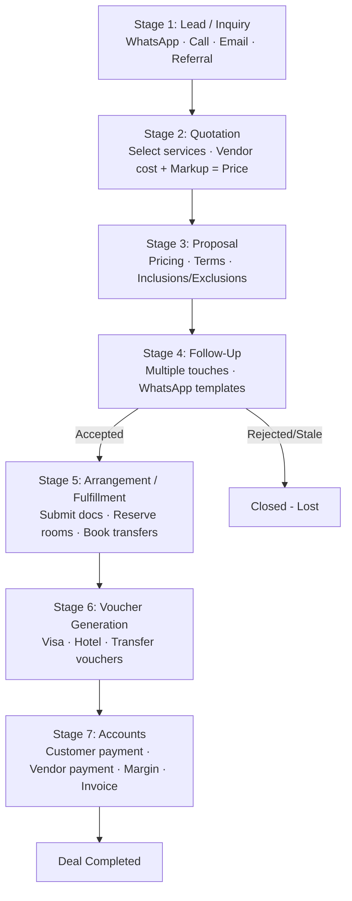

| Stage | Purpose | Key data captured |
|-------|---------|-------------------|
| **1 — Lead / Inquiry** | Capture inbound demand | Name, phone, company, inquiry type, destination, travel date, notes, raw message |
| **2 — Quotation** | Price the request | Services, vendor cost, markup, selling price, currency |
| **3 — Proposal** | Formalize the offer | Pricing, services, terms, inclusions/exclusions, validity |
| **4 — Follow-Up** | Convert (sales require multiple touches) | Follow-up date, notes, outcome, next action |
| **5 — Arrangement** | Operational fulfillment after acceptance | Per-service workstream (visa docs, room reservation, transfer booking) |
| **6 — Voucher** | Customer-facing confirmation documents | Reference numbers, dates, vendor/booking details |
| **7 — Accounts** | Financial closure | Customer payment, vendor payment, outstanding balance, profit, invoice status |

---

## 4. CRM Module Breakdown

Legend: ✅ Functional · 🟡 Partial · 🟣 Placeholder (UI only) · ⬜ Missing (not built)

| Module | Backend | Frontend | Status | Notes |
|--------|---------|----------|--------|-------|
| **Dashboard** | (derived on client) | `/dashboard` | ✅ | 6 metric cards, 14-day inquiry area chart, pipeline funnel, recent leads + upcoming follow-ups. Metrics computed client-side from list endpoints, not a backend analytics API. |
| **Leads** | `leads` module | `/leads`, `/leads/:id` | ✅ | Full CRUD, soft delete, activity timeline, 5-tab drawer (Overview, Timeline, Proposals, Follow-ups, Fulfillments), 3-step create modal. |
| **Proposals** | `proposals` module | `/proposals` | ✅ | Create/send/accept/reject, unique token, state machine, list w/ inline actions. **Single-amount only (no line items / margin).** |
| **Follow-Ups** | `followups` module | `/followups` | ✅ | Schedule, upcoming/completed tabs, outcome tracking. |
| **Fulfillments** | `fulfillments` module | `/fulfillments` | ✅ | Kanban + table views, 5 statuses, auto-created on proposal acceptance. This is the "Arrangement" stage. |
| **Reports / Analytics** | ⬜ (none) | `/analytics` | 🟡 | Client computes conversion rate, won value, distribution charts from raw lists. No server-side reporting. |
| **AI Assistant** | `ai` module | `/ai` + lead drawer | 🟡 | 3 stateless endpoints (parse-inquiry, followup-suggestion, proposal-summary). Not conversational; no memory/tools. |
| **Settings** | ⬜ | `/settings` | 🟡 | Theme toggle + read-only API connection info. No real settings persistence. |
| **Auth / Users** | 🟡 scaffold | ⬜ | 🟡 | JWT strategy + guards + roles exist, but **no login endpoint, no User schema, all routes `@Public()`.** |
| **Agencies** | ⬜ | `/agencies` | 🟣 | "Coming soon". |
| **Contacts** | ⬜ | `/contacts` | 🟣 | "Coming soon". |
| **Bookings** | ⬜ | `/bookings` | 🟣 | "Coming soon". (Conceptually overlaps Fulfillments today.) |
| **Vouchers** | ⬜ | `/vouchers` | 🟣 | "Coming soon". |
| **Service Catalog** | ⬜ | ⬜ | ⬜ | Services are enums, not data. |
| **Vendor Management** | ⬜ | ⬜ | ⬜ | No supplier entity, no cost sourcing. |
| **WhatsApp Integration** | ⬜ | ⬜ | ⬜ | `WHATSAPP` is only a source enum value. |
| **Accounts / Payments** | ⬜ | ⬜ | ⬜ | No invoices, payments, or ledger. |
| **Notifications / Queues** | 🟡 infra only | ⬜ | 🟡 | 3 BullMQ queues registered (`notifications`, `reports`, `followups`); **no processors**. |

---

## 5. End-to-End Inquiry Lifecycle

### 5.1 As implemented today

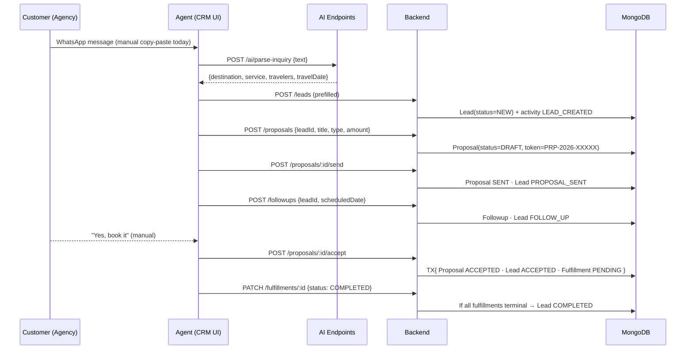

### 5.2 Status models (verbatim from code)

**Lead status** (`LeadStatus`): `NEW → PROPOSAL_SENT → AWAITING_RESPONSE → FOLLOW_UP →
ACCEPTED → REJECTED → COMPLETED`. Transitions are driven by sibling modules and logged as
activities.

**Proposal state machine** (`ProposalStatus`):

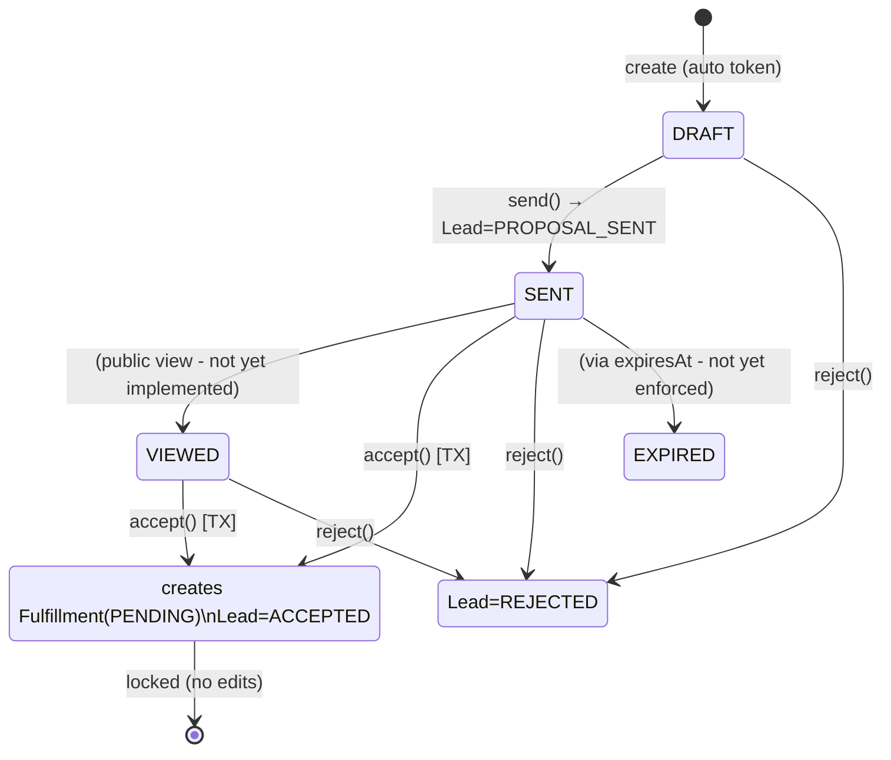

Key business rules confirmed in `proposals.service.ts`:
- Accept is **atomic**: `transitionStatus([SENT,VIEWED] → ACCEPTED)` inside a MongoDB
  transaction that also sets the lead to `ACCEPTED`, logs the activity, and creates the
  fulfillment. A lost race throws `INVALID_PROPOSAL_TRANSITION` and rolls back.
- An `ACCEPTED` proposal is **locked** (`PROPOSAL_LOCKED` on edit).
- `VIEWED` and `EXPIRED` states exist but have **no trigger implemented** (no public
  view-tracking endpoint; `expiresAt` is stored but not enforced by a job).

**Fulfillment state machine** (`FulfillmentStatus`): `PENDING → IN_PROGRESS →
WAITING_CUSTOMER → COMPLETED / CANCELLED`. On update to `COMPLETED`, the service counts
unresolved fulfillments for the lead; when none remain, the lead becomes `COMPLETED`
(supports multi-service deals).

**Proposal→Fulfillment type mapping** (`fulfillments.service.ts`): `VISA→VISA`,
`TRAVEL_PACKAGE→TRAVEL_PACKAGE`, `HOTEL→HOTEL`, `TRANSFER→TRANSFER`, `CUSTOM→CUSTOM`
(default `CUSTOM`).

---

## 6. AI Assistant Responsibilities

### 6.1 What exists today (`modules/ai`)

A provider-agnostic AI layer (`AIProvider` interface, DI token `AI_PROVIDER`) with a single
implementation: **`GroqProvider`** — uses the official `groq-sdk` (default model
`qwen/qwen3.6-27b`, 15s timeout, 1 retry, `reasoning_effort` configurable via
`GROQ_REASONING_EFFORT`, default `none`). Prompts share a `DMC_ASSISTANT_PERSONA` constant
tuned for travel/tour enquiries and inject the **current date** so relative dates resolve to
the next future occurrence. Four endpoints, all `@Public()`:

| Endpoint | Input | Output | Prompt behavior |
|----------|-------|--------|-----------------|
| `POST /ai/parse-inquiry` | `{ text }` | `{ destination, service, travelers, travelDate }` | JSON mode, temp 0; service constrained to Visa/Travel Package/Hotel/Transfer/Custom; today's date injected for year inference. |
| `POST /ai/followup-suggestion` | `{ leadName, inquiryType, status, context? }` | `{ message }` | ≤3-sentence professional WhatsApp-style follow-up. |
| `POST /ai/proposal-summary` | `{ title, proposalType, amount?, currency?, description? }` | `{ summary }` | ≤4-sentence client-friendly pitch. |
| `POST /ai/chat` | `{ message, history?, context? }` | `{ reply }` | Multi-turn conversational DMC assistant (visas, itineraries, packages, drafting, quotation guidance); temp 0.5, 1200 tokens, keeps up to 20 prior turns. Optional `context` carries the CRM record the agent is viewing, so it answers about the actual lead/deal. Surfaced as the default **Assistant** tab; the lead drawer publishes its record via `ui.store` → the widget shows an "Answering about …" chip. |
| `POST /ai/next-action` | `{ context, message? }` | `{ summary, action }` | JSON mode; recommends the single best next action grounded in the record. `action.type` ∈ `create_followup / add_note / update_status / create_proposal / none`; fields are validated/coerced backend-side (status & proposalType checked against enums, currency clamped to 3 chars, price never guessed). The widget renders it as a **confirmable card** ("Next action" button) that applies via the existing `useCreateFollowup / useAddLeadActivity / useUpdateLead / useCreateProposal` mutations — human-in-the-loop, no autonomous writes. |

> Note: the provider is **Groq** (`groq-sdk`), configured via `GROQ_API_KEY` + `GROQ_MODEL`.
> If `GROQ_API_KEY` is unset the endpoints return `AI_NOT_CONFIGURED`.

### 6.2 Target AI responsibilities (vision)

| Capability | Today | Target |
|------------|-------|--------|
| Inquiry understanding | ✅ parse-inquiry | Structured extraction + entity resolution (nationality, pax, dates, destination) |
| Service recommendation | ⬜ | Match inquiry → catalog services |
| Pricing assistance | ⬜ | Pull vendor cost, apply markup rules, compute selling price |
| Proposal drafting | 🟡 summary only | Full multi-line proposal generation |
| Follow-up drafting | ✅ single message | Sequence/cadence-aware follow-ups |
| Voucher drafting | ⬜ | Generate voucher content from booking data |
| Knowledge assistant | ⬜ | Answer operational questions (RAG over catalog/policies) |
| Conversational agent | 🟡 `POST /ai/chat` — multi-turn, **CRM-context-aware**; `POST /ai/next-action` recommends a **confirmable action** (schedule follow-up / add note / update status / draft proposal) the agent applies with one click via existing mutations | Fully autonomous tool-calling + live web/RAG ("operational brain") |

---

## 7. Current State Assessment

### 7.1 What is genuinely built and working

- **Backend pipeline**: `leads`, `proposals`, `followups`, `fulfillments`, `ai` modules —
  clean NestJS architecture (controller → service → repository → Mongoose), Zod-validated
  env, standardized `{ success, data, message, timestamp }` envelope, Swagger docs, Pino
  logging, Helmet/CORS/compression, rate limiting.
- **Data integrity**: soft deletes everywhere; append-only `LeadActivity` audit timeline;
  atomic proposal-acceptance transaction; unique proposal tokens with retry.
- **Frontend**: 8 functional React 19 screens with TanStack Query caching, RHF+Zod forms,
  Radix UI + Tailwind design system, Kanban board, charts, command palette, AI widget.

### 7.2 What looks done but is only partial / scaffolding

| Area | Reality |
|------|---------|
| **Authentication/RBAC** | `JwtAuthGuard`, `RolesGuard`, `ApiKeyGuard` are registered as global `APP_GUARD`s, **but every feature controller is `@Public()`**, there is **no login/refresh endpoint**, and **no `User` collection**. Roles are seeded (`SUPER_ADMIN`, `ADMIN`, `MANAGER`, `AGENT`) with empty permissions. The only real gate is the optional `x-api-key` header. **The API is effectively open.** |
| **Analytics** | No backend; the frontend fetches up to 100–200 raw records and computes metrics in the browser. Won't scale. |
| **Queues** | `notifications`, `reports`, `followups` queues are declared but have **no processors** — nothing runs. |
| **AI** | 3 one-shot endpoints, no conversation/memory/tools; `followup-suggestion` is only surfaced in the lead drawer. |
| **Settings** | Displays theme + API info; no persisted org/settings. |

### 7.3 What is missing entirely (vs. the DMC business)

Service Catalog · Vendor/Supplier management · **Cost + markup + margin model** ·
Multi-line quotations · WhatsApp inbound/outbound · Voucher generation · Accounts/invoices/
payments · Agencies & Contacts (B2B customer records) · Notifications delivery · Multi-tenancy.

### 7.4 Naming reconciliation (README vs. code)

The README lists planned modules (`agencies`, `inquiries`, `quotes`, `bookings`, `vouchers`,
`analytics`, `notifications`, `users`). In the actual code these map/rename as: **inquiries →
`leads`**, **quotes → `proposals`**, **bookings/arrangement → `fulfillments`**. The rest are
not implemented on the backend.

---

## 8. Future State Vision

The target is to collapse the manual WhatsApp workflow into an automated, AI-assisted
pipeline where the DMC's margin and vendor coordination are first-class:

```
WhatsApp Inquiry
  → AI Assistant (understand + structure)
  → Service Matching (catalog)
  → Auto Quotation (vendor cost + markup rules)
  → Auto Proposal (multi-line, branded, shareable link)
  → Follow-up Automation (cadence + WhatsApp templates)
  → Arrangement Workflow (per-service operational tasks + vendor POs)
  → Voucher Generation (PDF, per service)
  → Accounts Workflow (invoice, customer payment, vendor payment, margin)
```

**Guiding principles**
1. **Service-driven & pluggable** — every new service type is data + a strategy, not a code
   change or new enum.
2. **Margin is first-class** — cost, markup, and profit are modeled at the line-item level.
3. **WhatsApp-native** — inbound messages create/append leads; outbound uses templates.
4. **AI-augmented, human-in-the-loop** — AI drafts; agents approve.
5. **Auditable** — every state change is logged (the activity-timeline pattern already
   established generalizes well).

---

## 9. Recommended Architecture

### 9.1 System context (target)

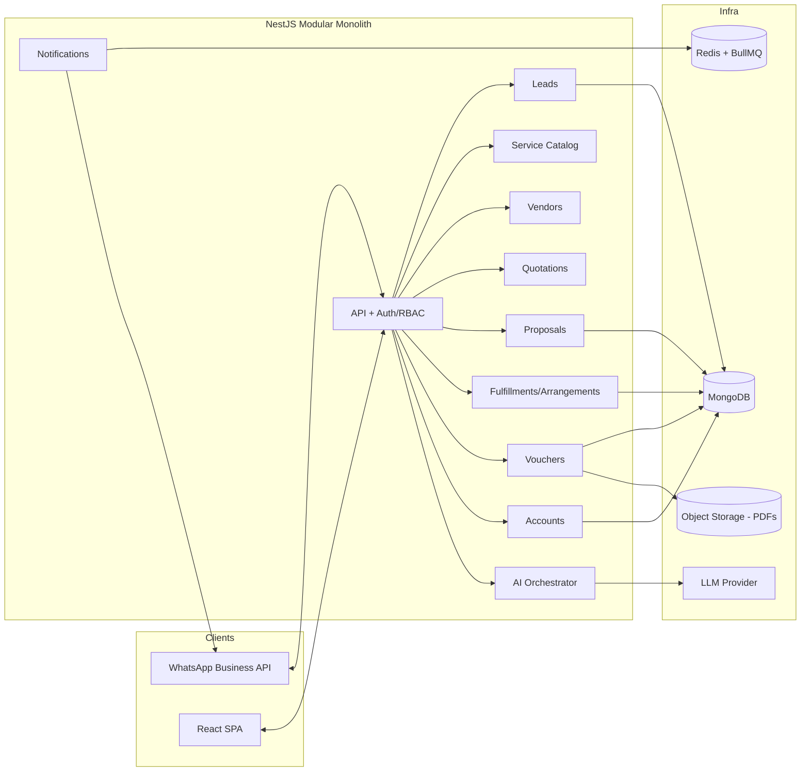

### 9.2 Module-by-module recommendations

- **CRM core** — keep the current controller→service→repository layering. Extract shared
  base repository (pagination/soft-delete) to remove per-module duplication.
- **Service Catalog** — new `services` collection defining bookable service types, required
  fields (JSON schema per type), and default terms. Replace `InquiryType`/`ProposalType`
  enums with catalog references (keep enums as a migration bridge).
- **Vendors** — `vendors` + `vendor_rates` collections; rate lookup feeds quotation.
- **Quotation** — new layer between lead and proposal: multi-line items each with
  `vendorCost`, `markup`, `sellingPrice`. Proposal becomes a *rendered, versioned snapshot*
  of a quotation.
- **Workflow engine** — model fulfillment as a set of **tasks/checklists per service type**
  (strategy pattern keyed by catalog service), not a single status field.
- **Vouchers** — templating service (Handlebars/MJML → HTML → PDF via headless renderer),
  stored in object storage, referenced from the fulfillment.
- **AI Orchestrator** — wrap the existing provider interface with a tool-calling loop; add a
  Groq/OpenAI provider option; add RAG over the catalog/policies for the knowledge assistant.
- **WhatsApp** — dedicated integration module: inbound webhook → lead upsert; outbound via
  the `notifications` queue with approved templates.
- **Accounts** — `invoices`, `payments` (customer + vendor), ledger view of margin.
- **Auth** — implement login/refresh, a `User` collection, and **remove blanket `@Public()`**;
  enforce roles per route. Consider tenant scoping if multi-DMC.

### 9.3 Async & jobs

Implement the already-registered BullMQ queues:
- `notifications` → send WhatsApp/email (follow-up reminders, proposal-sent, voucher-ready).
- `followups` → due-date reminders; proposal `expiresAt` enforcement (→ `EXPIRED`).
- `reports` → nightly analytics rollups feeding a real dashboard API.

---

## 10. Database Entity Suggestions

### 10.1 Current collections (implemented)

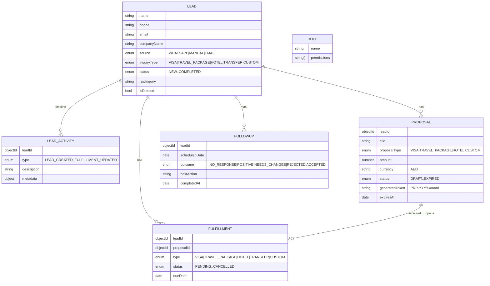

> All documents share `id`, `createdAt`, `updatedAt` (via `baseSchemaOptions`,
> `timestamps: true`, `versionKey: false`), plus `isDeleted`/`deletedAt` soft-delete fields.

### 10.2 Proposed new/extended collections (to reach the vision)

| Collection | Purpose | Key fields |
|------------|---------|------------|
| **User** | Actual accounts (missing today) | `email`, `passwordHash`, `roleId`, `isActive` |
| **Agency** | B2B customer (buyer) | `name`, `country`, `creditTerms`, `contacts[]` |
| **AgencyContact** | People at an agency | `agencyId`, `name`, `phone`, `email`, `role` |
| **Service** (catalog) | Bookable service definition | `code`, `category`, `fieldSchema`, `defaultTerms` |
| **Vendor** | Supplier | `name`, `serviceCategories[]`, `contact`, `paymentTerms` |
| **VendorRate** | Cost source | `vendorId`, `serviceCode`, `netCost`, `currency`, `validity` |
| **Quotation** | Priced request (pre-proposal) | `leadId`, `lineItems[]`, `subtotal`, `margin`, `total` |
| **QuoteLineItem** | Per-service pricing | `serviceCode`, `vendorId`, `vendorCost`, `markup`, `sellingPrice`, `qty` |
| **Booking** | Confirmed reservation w/ vendor | `fulfillmentId`, `vendorId`, `confirmationNo`, `status` |
| **Voucher** | Customer-facing document | `bookingId`, `type`, `reference`, `pdfUrl`, `issuedAt` |
| **Invoice** | Customer billing | `agencyId`, `leadId`, `amount`, `status` |
| **Payment** | Money in/out | `invoiceId`/`vendorId`, `direction`, `amount`, `paidAt` |

**Most important schema change:** introduce **line items with `vendorCost` + `markup` +
`sellingPrice`** so margin is computed and reportable. The current single-`amount` proposal
cannot express the DMC's core economics.

---

## 11. Workflow Diagrams (Mermaid)

### 11.1 Lead status lifecycle

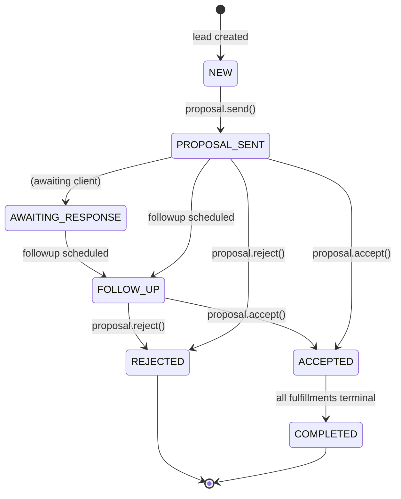

### 11.2 Target quotation → margin flow (future)

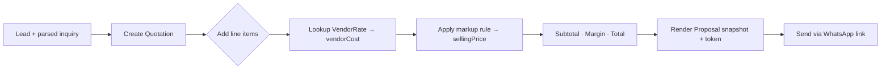

### 11.3 Acceptance → fulfillment → voucher → accounts (target)

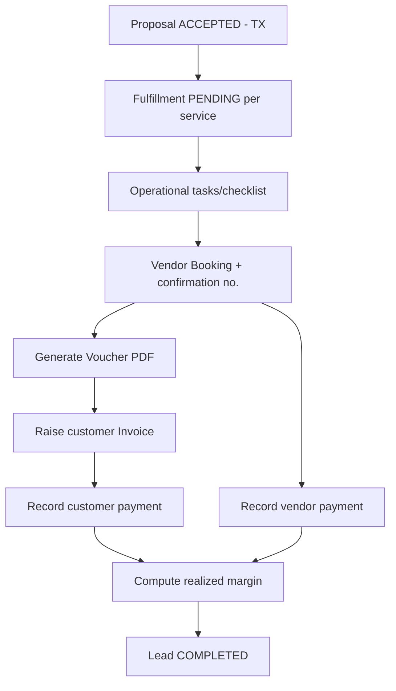

---

## 12. User Roles & Permissions

### 12.1 Current (seeded, not enforced)

`database/seed.ts` upserts four roles; only `SUPER_ADMIN` has permissions (`['*']`), the
rest are empty:

| Role | Intended scope | Permissions today |
|------|----------------|-------------------|
| `SUPER_ADMIN` | Full platform access | `['*']` |
| `ADMIN` | Tenant administration | `[]` |
| `MANAGER` | Operations management | `[]` |
| `AGENT` | Sales / operations agent | `[]` |

> **Not enforced:** there is no `User` collection and no login, and all controllers are
> `@Public()`. `@Roles(...)` metadata + `RolesGuard` exist but are never applied to routes.

### 12.2 Recommended permission matrix (target)

| Capability | AGENT | MANAGER | ADMIN | SUPER_ADMIN |
|------------|:----:|:------:|:----:|:----------:|
| Manage own leads/proposals/follow-ups | ✅ | ✅ | ✅ | ✅ |
| View all leads / reassign | — | ✅ | ✅ | ✅ |
| Approve pricing / override markup | — | ✅ | ✅ | ✅ |
| Manage service catalog & vendors | — | — | ✅ | ✅ |
| Accounts (invoices/payments) | — | ✅(view) | ✅ | ✅ |
| Manage users & roles | — | — | ✅ | ✅ |
| Platform/tenant configuration | — | — | — | ✅ |

**Action items:** implement `User` + login/refresh; remove blanket `@Public()`; annotate
routes with `@Roles(...)`; move from role-only checks to permission strings for finer control.

---

## 13. WhatsApp Automation Flow

WhatsApp is the client's primary channel but is **entirely manual today** (`WHATSAPP` is just
a `LeadSource` value). Target design:

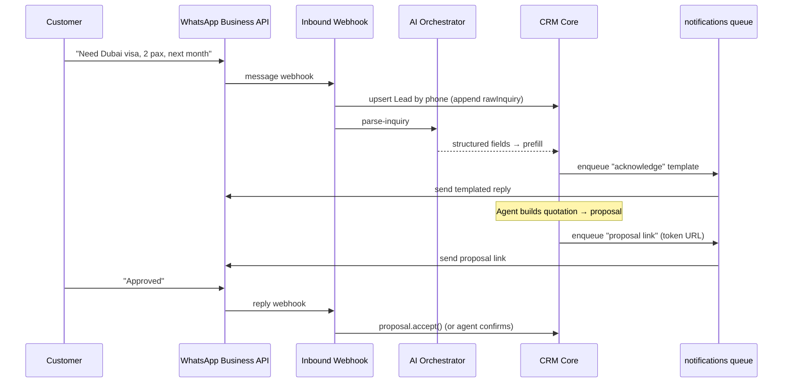

**Components to build:** provider adapter (Meta Cloud API / Twilio), inbound webhook with
signature verification, phone→lead identity resolution, approved message templates,
outbound via the `notifications` BullMQ queue (rate-limited, retryable), and opt-in/consent
tracking.

---

## 14. Service Catalog Design

**Problem:** service types are hard-coded enums (`InquiryType`, `ProposalType`,
`FulfillmentType`) that don't even agree (`TRANSFER` exists in inquiries/fulfillments but not
in `ProposalType`). Adding a service = code change + migration.

**Design:** a data-driven **Service Catalog**.

```
Service {
  code: "DXB_TOURIST_VISA"        // stable key
  category: VISA | HOTEL | TRANSFER | ACTIVITY | INSURANCE | FLIGHT | PACKAGE
  name, description, defaultCurrency
  fieldSchema: JSON Schema        // required inputs per service (e.g. nationality, pax)
  defaultTerms, processingTime
  isActive
}
```

- Categories map to fulfillment **workstream strategies** (visa = document collection +
  submission; hotel = room reservation; transfer = pickup scheduling).
- Quotation line items reference `Service.code`, so new services are **config, not code**.
- Migration bridge: seed catalog rows for existing enum values; keep enums until fully cut over.

**Seed categories (from the brief):** Visa (Tourist/Business/Transit), Hotel (Hotel/Resort/
Apartment), Transfer (Pickup/Drop/Chauffeur/Intercity), Holiday Packages, Tours & Activities
(Desert Safari, Burj Khalifa, Yacht, Theme Parks), Insurance, Flight Assistance.

---

## 15. Vendor Management Design

**Problem:** there is no supplier concept and no cost basis, so **margin is invisible**.

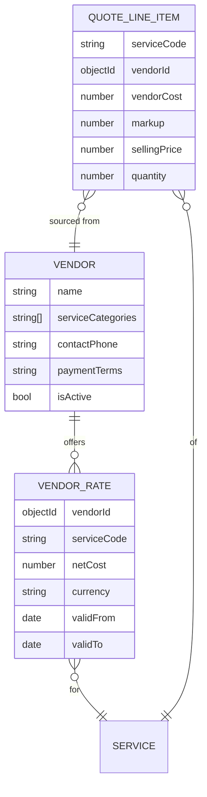

**Pricing flow:** pick service → resolve `VendorRate.netCost` → apply markup rule
(percentage or fixed, possibly per agency/service) → `sellingPrice`. Sum line items →
quotation total; margin = Σ(sellingPrice − vendorCost). On booking, a **vendor
purchase/payment** record closes the loop for the accounts stage.

---

## 16. Voucher System Design

**Goal:** generate customer-facing confirmation documents per booked service (Stage 6).

```
Voucher {
  bookingId, fulfillmentId, leadId
  type: VISA | HOTEL | TRANSFER | ACTIVITY | ...
  reference                      // e.g. hotel confirmation no.
  payload: {                     // type-specific
     VISA:     { visaReference, approvalDate, validity }
     HOTEL:    { hotelName, checkIn, checkOut, confirmationNo, roomType }
     TRANSFER: { pickupTime, driverName, vehicle, contact }
  }
  pdfUrl, issuedAt, issuedBy
}
```

**Pipeline:** typed template (Handlebars/MJML) → HTML → PDF (headless renderer) → object
storage → URL persisted → optional delivery via `notifications` queue (WhatsApp/email).
Templates are per service category and branded per DMC (multi-tenant ready).

---

## 17. Accounts Workflow

Stage 7 turns a completed deal into money and margin. Currently **unmodeled**.

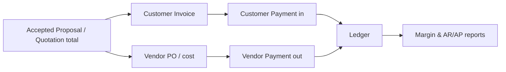

**Entities:** `Invoice` (customer), `Payment` (in/out, linked to invoice or vendor),
derived views for **outstanding balance (AR/AP)**, **realized margin** (payments) vs.
**projected margin** (quotation), and **invoice status**. Feed the `reports` queue for
nightly financial rollups.

---

## 18. Product Roadmap

| Phase | Theme | Scope | Unlocks |
|-------|-------|-------|---------|
| **0 — Harden MVP** | Security & correctness | Implement `User` + login/refresh; remove blanket `@Public()`; enforce `@Roles`; enforce proposal `expiresAt` (job) & `VIEWED` tracking (public token endpoint) | A safe-to-deploy pipeline |
| **1 — Margin & Catalog** | Core DMC economics | Service Catalog, Vendors, Vendor Rates, **Quotation with line items (cost+markup+margin)**; Proposal becomes a quotation snapshot | The business's actual money model |
| **2 — WhatsApp** | Channel automation | Inbound webhook → lead upsert, outbound templates via `notifications` queue, AI acknowledge/parse on arrival | Replace manual WhatsApp |
| **3 — Fulfillment Engine** | Operations | Per-service task/checklist strategies, vendor bookings & confirmations | Structured arrangement stage |
| **4 — Vouchers** | Documents | Templated PDF vouchers per service, storage + delivery | Customer-facing confirmations |
| **5 — Accounts** | Finance | Invoices, payments (in/out), AR/AP, realized vs. projected margin | Financial closure & reporting |
| **6 — AI Assistant** | Intelligence | Conversational, tool-using orchestrator; RAG knowledge assistant; automated follow-up cadences | The "operational brain" |
| **7 — Scale** | Platform | Backend analytics API, queue processors, notifications, multi-tenancy, service extraction | Enterprise readiness |

---

## 19. Technical Debt / Missing Modules

**Security / correctness (highest priority)**
- API is effectively **unauthenticated**: all controllers `@Public()`, no login, no `User`.
- AI (Groq) key is optional → AI endpoints return `AI_NOT_CONFIGURED` if `GROQ_API_KEY` unset.
- Proposal `EXPIRED`/`VIEWED` states exist but are never triggered (no job, no public view).
- Public proposal-acceptance link implied by the token but no public token endpoint exists.

**Architecture / modeling**
- **No cost/markup/margin** — the defining DMC metric is not representable.
- Service types are **inconsistent enums** across modules (e.g. `TRANSFER` absent from
  `ProposalType`); should be a catalog.
- Analytics computed client-side over capped list fetches (100–200 rows) — won't scale.
- Repositories duplicate pagination/soft-delete logic per module (extract a base repo).

**Missing modules (backend)**
- Service Catalog · Vendors/Rates · Quotations (line items) · Agencies/Contacts · Bookings ·
  Vouchers · Invoices/Payments · Notifications delivery · Queue **processors** · WhatsApp.

**Frontend placeholders**
- `/agencies`, `/contacts`, `/bookings`, `/vouchers` are "Coming soon"; no auth/login screen,
  no role-based UI gating, no real-time updates.

**Ops**
- Queues declared without consumers; no scheduled jobs (follow-up reminders, expiries).

---

## 20. Final Project Understanding

The **DMC CRM** is a well-engineered **MVP of a travel sales pipeline** built as a NestJS
modular monolith + React 19 SPA. Its implemented core — **Lead → Proposal → Fulfillment**
with follow-ups, a per-lead audit timeline, atomic acceptance transactions, and three AI
helper endpoints — is clean, typed, documented, and a solid foundation.

However, measured against the **DMC business model**, the current system implements the
*form* of the pipeline but not yet its *economic and operational substance*:

- It tracks a deal's **stages** but not its **money** — there is no vendor cost, markup,
  margin, or multi-line quotation, which is the very thing a DMC exists to manage.
- It names **WhatsApp** as a source but does not **integrate** it — the channel that drives
  the whole business is still manual.
- It has **placeholders** for the operational back half (vendors, bookings, vouchers,
  accounts) that turn an accepted proposal into a delivered, paid, profitable job.
- Its **AI** is three useful one-shot tools, not the conversational operational brain the
  vision calls for.
- Its **auth** is scaffolding: the API is effectively open and there are no user accounts.

**The path forward** (Section 18) is therefore: first **harden** (real auth), then build the
**margin + catalog + vendor** core that encodes how a DMC actually earns, then **automate the
WhatsApp channel**, then complete the **fulfillment → voucher → accounts** operational tail,
and finally elevate the **AI** into a true assistant. Each of these fits cleanly onto the
existing module boundaries and the established patterns (activity logging, transactional
service methods, provider interfaces, BullMQ queues), so this is **incremental extension,
not a rewrite.**

---

*Generated from a direct read of the backend (`backend/src`) and frontend (`frontend/src`)
source. "Current state" statements are grounded in code; "Planned/Placeholder/Missing"
items have no implementation yet.*
